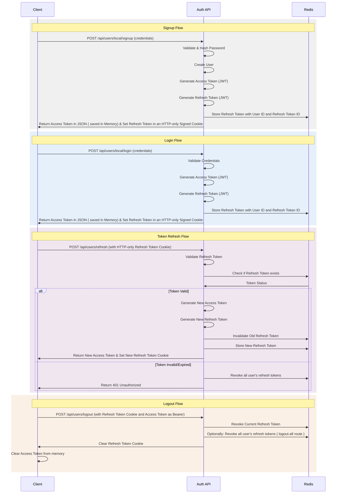

# El-Marchi-API App Usage and Developement

Here, I explain different things used in the code so it would be easier for anyone to catch on with these details when developing new features.

## 🔐 Authentication Mechanism Explained

Authentication follows a JWT based Mechanism. We have *2 types of JWTs*: ***ACCESS_TOKEN*** and ***REFRESH_TOKEN***.

Both tokens use their own public/private keys.

Access Token will be saved in memory, short-lived, passed as Bearer Authorization HTTP Header.

Refresh Token will be saved in HTTP-Only, signed cookie, long-lived, passed when we need to refresh the access tokens.

When signing up or logging in, a refreshTokenID is generated marking that session. This refreshTokenID must be static as it identifies the session. (Token rotation keeps the same refreshTokenID Value).

### How Secure is the system

Having Access Tokens saved in **Memory** means that they will not be accessed by a user as they are not stored in localStorage. They are short-lived so each some minutes it will expire and have to be refreshed.

This is perfect so in case an access token is compromised it will be invalidated shortly.

In the case where the refresh token is compromised, the malicious user will refresh the token invalidating the one that the other user has. Once this user tries to refresh the token with his now outdated refresh token, all refresh tokens related to the user will be invalidated, forcing everyone to login again.

This system ensures security.

Using Elliptic Curve Cryptography as the signing algorithm for JWT means that we have an asymmetric system and hence we can at a future point, seperate validation from signing without any security concerns: ***Public Key*** is used for validation and can be shared without any problems. The ***Private Key*** which is used for signing will only be used by a central authentication app/middleware/proxy, etc. (Making our system not only stateless but also robust as if one system is compromised there is no harm or security problem to authentication as the attacker will only have the public key).

**A Valid Criticism for this approach** is the fact that we are sending the refresh token cookie with each request which would add an unnecessary overhead. This is absolutly true. However, we have workarounds to deal with this mainly using fetch's credentials parameter or by using axios as we can set the cookies content manually.

### Authentication Routes

Here are the Authentication related routes.

For now we do only have local authentication methods. In the future other methods can be added.

- `/api/users/local/login`: Login route -> retruns the tokens.
- `/api/users/local/signup`: signup route -> create the user and retruns the tokens.
- `/api/users/logout`: Logout route -> invalidates the current refresh token and deletes the cookie.
- `/api/users/logout-all`: Logout route -> invalidates all refresh tokens related to the current user.
- `/api/users/refresh`: Refresh the Tokens route -> invalidates old refresh token, rotates tokens and returns them.

### Error codes and their meaning in the server

- ***400 Bad Request:*** The server *cannot process* the request due to **client-side issues**, such as malformed syntax or invalid data.
- ***400 Unauthorized:*** The request *lacks valid authentication credentials*. This status is used when:
  - the client has not provided credentials
  - the provided credentials are invalid.
  - the tokens expired.
- ***400 Forbidden:*** The server *understands* the request but **refuses** to authorize it. This status is used when the client is authenticated but *does not have the necessary permissions to access the resource*.

### Sequence Diagrams



## 🛂 Authorization Mechanism Explained

## 🛠 Configuration & Validation

This project uses Zod for type-safe environment configuration and request validation. Here's how to use it:

### 1. Environment Variables

As I mentionned in the main README.MD file, in order to start working you have to follow the examples:
Create the `.env` file using one of the two templates `.env.dev.example` or `.env.prod.example` and Fill the placeholders.

```bash
cp .env.dev.example .env
# OR
cp .env.prod.example .env
```

### 2. Adding New Variables

In order to add new environment variables to the project, follow these steps:

1. Update the schema in `src/app/common/config/env.schema.ts`:

    ```typescript
    export const envSchema = z.object({
      NEW_VARIABLE: z.string().min(5), // What ever you need
    });
    ```

2. Add to your `.env` file:

    ```env
    NEW_VARIABLE=value
    ```

### 3. Using Configuration

Access config values in services:

```typescript
import { ConfigService } from '@nestjs/config';

@Injectable()
export class MyService {
  constructor(private config: ConfigService) {
    const dbUrl = this.config.get('DATABASE_URL');
  }
}
```

### 4. Request Validation

Create DTOs using Zod:

```typescript
// src/users/dto/create-user.dto.ts
export class CreateUserDto extends createZodDto(
  z.object({
    email: z.string().email(),
    password: z.string().min(8),
  })
) {}
```

Use in controllers:

```typescript
@Post()
createUser(@Body() dto: CreateUserDto) {
  // dto is automatically validated
}
```

### 5. Error Handling

Validation errors will return formatted responses:

```json
{
  "statusCode": 400,
  "message": "Validation failed",
  "errors": [
    {
      "path": ["email"],
      "message": "Invalid email"
    }
  ]
}
```
